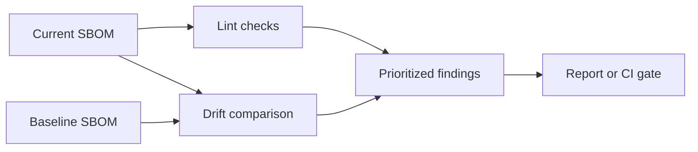

# sbom-drift

<p align="center">
  
</p>

<p align="center">
  <a href="https://github.com/KhanSaahib/sbom-drift/actions/workflows/ci.yml"></a>
  <a href="https://www.python.org/downloads/"></a>
  
  <a href="LICENSE"></a>
</p>

<p align="center"><strong>Catch weak SBOMs and suspicious dependency drift before they reach production.</strong></p>

<p align="center">
  <a href="#quick-start">Quick start</a> ·
  <a href="#how-it-works">How it works</a> ·
  <a href="#usage">Usage</a> ·
  <a href="CONTRIBUTING.md">Contributing</a>
</p>

> [!TIP]
> **Start here:** Run the fixture-backed [quick start](#quick-start). If it helps, [star this repo](https://github.com/KhanSaahib/sbom-drift) and [follow @KhanSaahib](https://github.com/KhanSaahib) for more practical blue-team tools.

Offline CycloneDX SBOM linter and drift detector. Dependency-free Python
(standard library only) — no network access, no vulnerability-feed API key,
nothing to trust beyond the SBOM files you hand it.

- **Lint:** find missing hashes, licenses, versions, names, and conflicting duplicates.
- **Diff:** expose changed or removed hashes, component churn, and metadata drift.
- **Gate:** choose a failure threshold and emit text, Markdown, or schema-versioned JSON.

## Quick start

Use the included fixtures to see both modes immediately:

```bash
git clone https://github.com/KhanSaahib/sbom-drift.git
cd sbom-drift
python -m pip install -e .
sbom-drift --fail-on never lint tests/fixtures/bad_hygiene.json
sbom-drift --fail-on never diff tests/fixtures/baseline.json tests/fixtures/current_drift.json
```

Then replace the fixture paths with SBOMs from your own builds.

## How it works



## Why

Software Bills of Materials are increasingly produced automatically by
build pipelines (Syft, cyclonedx-maven-plugin, npm's `sbom` command, etc.),
but two failure modes slip past most SBOM tooling:

1. **Hygiene rot** — components with no integrity hash, no license, a
   floating version marker (`latest`, `unknown`), or the same package
   identity listed twice with conflicting versions. An SBOM full of these
   gives you paperwork, not verifiability.
2. **Silent drift between builds** — the same pipeline, run twice, produces
   an SBOM where a component's *hash* changed while its *name and version*
   stayed identical. That's either a non-reproducible build or a tampered
   dependency (a mutable tag, a compromised registry, a MITM'd fetch) —
   exactly the kind of supply-chain compromise a version-pinning policy is
   supposed to prevent, and exactly what a single point-in-time SBOM scan
   can't see.

`sbom-drift` does both: `lint` catches hygiene rot in one SBOM, `diff`
compares two SBOM snapshots (e.g. yesterday's nightly build vs. today's) and
flags what changed, weighted by how suspicious the change is.

## Install

No dependencies beyond the Python 3.10+ standard library.

```bash
git clone https://github.com/KhanSaahib/sbom-drift.git
cd sbom-drift
python3 -m unittest discover -s tests -v   # optional: run the test suite
```

Or install it as a package (console script `sbom-drift`):

```bash
python3 -m pip install -e .
sbom-drift --help
```

## Usage

### Lint a single SBOM

```bash
sbom-drift lint sbom.json
```

Checks:

| Check | Severity | What it catches |
|---|---|---|
| `empty-sbom` | high | document has no components and provides no dependency visibility |
| `missing-name` | high | component has no stable name and cannot be tracked reliably |
| `missing-hash` | medium | component has no `hashes` entry — contents can't be verified |
| `malformed-hash` | medium | declared digest contains non-hex content |
| `missing-license` | low | component declares no license |
| `unknown-version` | medium | version is empty or a floating marker (`latest`, `unknown`, `0.0.0`, ...) |
| `duplicate-component-conflicting-version` | high | same purl/name appears twice with different versions |

### Diff two SBOM snapshots

```bash
sbom-drift diff baseline.json current.json
```

Checks:

| Check | Severity | What it catches |
|---|---|---|
| `hash-changed-same-version` | high | name+version identical, hash differs — likely tampering, a mutable tag, or a non-reproducible build |
| `hash-removed-same-version` | medium | integrity hashes disappeared without a version change |
| `hash-not-comparable-same-version` | medium | hash algorithms changed, leaving no digest that can be compared |
| `component-added` | medium | new component in `current` not present in `baseline` |
| `version-changed` | info | same component, version bumped |
| `license-changed` | low | same name+version, declared license changed or disappeared |
| `component-removed` | info | component in `baseline` dropped from `current` |

### Output formats and CI gating

```bash
sbom-drift --format json diff baseline.json current.json -o report.json
sbom-drift --format markdown lint sbom.json -o report.md
```

`--fail-on {high,medium,low,info,never}` (default `high`) controls the exit
code: `1` if a finding at or above that severity exists, `0` otherwise, `2`
on a malformed input file. Wire it into CI as a build gate, e.g.
`sbom-drift --fail-on high diff baseline.json current.json`.

## Design

- `sbom_drift/cyclonedx.py` — reads and flattens CycloneDX JSON (`bomFormat`,
  `components`, `purl`, `hashes`, `licenses`). Component identity for
  diffing is the purl with its version segment stripped, so a version bump
  is recognized as *the same component changing* rather than one component
  disappearing and an unrelated one appearing.
- `sbom_drift/lint.py` — single-SBOM hygiene checks.
- `sbom_drift/diff.py` — two-SBOM drift checks.
- `sbom_drift/findings.py` — shared `Finding` model + severity sort.
- `sbom_drift/report.py` — text / markdown / JSON rendering.
- `sbom_drift/cli.py` — argparse CLI (`lint`, `diff` subcommands).

## Tests

`tests/` uses the standard-library `unittest` module (also discoverable by
pytest if installed) against fixture SBOMs in `tests/fixtures/`:
`baseline.json` / `current_clean.json` (identical, drift-free pair),
`current_drift.json` (hash change, version bump, added/removed component),
and `bad_hygiene.json` (every lint check). Run with:

```bash
python3 -m unittest discover -s tests -v
```

## Scope and limitations

- CycloneDX JSON only (no SPDX, no XML) — the common output format for
  Syft, npm, and most CI SBOM generators today.
- No vulnerability database lookups (that's what Grype/OSV are for) — this
  tool is about SBOM *integrity and drift*, not known-CVE matching.
- "Hash changed" is a signal to investigate, not proof of compromise —
  non-reproducible builds produce the same signal.

## License

MIT — see [LICENSE](LICENSE). Attributions for design inspiration (no code
reused) are in [NOTICE.md](NOTICE.md).

## Community and project health

- [Contributing guide](CONTRIBUTING.md) — development setup and review expectations
- [Code of Conduct](CODE_OF_CONDUCT.md) — participation standards and enforcement
- [Security policy](SECURITY.md) — supported versions and private reporting
- [Support guide](SUPPORT.md) — how to ask for help safely
- [Changelog](CHANGELOG.md) — notable changes by release
